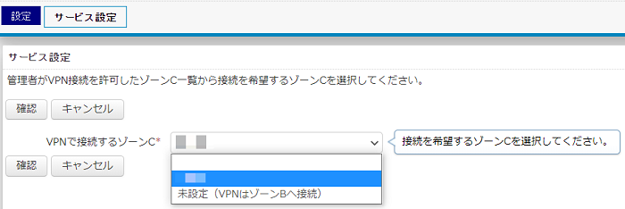

# Set Up Your Local Environment

In general, if your computer can use SSH and you are on the lab network, you do not need much extra setup to reach the VIS Lab servers. Still, a comfortable local setup makes day-to-day development much nicer (:

In this chapter, we will cover:

1. Setting up a terminal that is comfortable for long-term use;
2. Checking what kind of network you are currently on;
3. What to do in the lab, on the university VPN, and off campus.

## 1. Set Up a Good Terminal

=== "macOS"

    The built-in macOS Terminal works fine, but I personally recommend [Ghostty](https://ghostty.org/). It looks clean, feels fast, and the default setup is comfortable. If you prefer something more mature with more existing guides, [iTerm2](https://iterm2.com/) is also a good choice.

    The most common package manager on macOS is [Homebrew](https://brew.sh/). You can install it from the terminal:

    ```bash
    /bin/bash -c "$(curl -fsSL https://raw.githubusercontent.com/Homebrew/install/HEAD/install.sh)"
    ```

    Homebrew is roughly an app store for developers. Once it is installed, you can use the `brew` command to install software. For example:

    ```bash
    brew install --cask ghostty
    brew install --cask iterm2
    ```

    You only need one of them.

=== "Windows"

    On Windows, the built-in PowerShell is already good enough, so I do not recommend another terminal here.

    You can use `winget` to install common software on Windows. For beginners, though, it is usually easier to download the installer directly from the official website.

=== "Linux"

    Most Linux desktop environments already come with a good terminal, such as GNOME Terminal, Konsole, or the default Terminal app. In most cases, you do not need to install another one.

    If you want a more modern terminal, [Ghostty](https://ghostty.org/) is also worth trying. On Linux, it is usually installed through distribution or community-maintained packages. If your package manager does not provide Ghostty yet, the default terminal is still completely fine.

    If your system does not have an SSH client yet, install it with your distribution's package manager. On Ubuntu / Debian:

    ```bash
    sudo apt update
    sudo apt install openssh-client
    ```

    On Fedora:

    ```bash
    sudo dnf install openssh-clients
    ```

    On Arch Linux:

    ```bash
    sudo pacman -S openssh
    ```

    If you are not sure which distribution you are using, just open a terminal and try the `ssh` command first. If it shows help text or usage information, you are good to go.

## 2. Connect Directly to the Zone C LAN in the Lab

If you are in the lab and connected to the Zone C local network, you can usually access the servers through their internal IP addresses.

Server addresses often look like `10.30.81.XXX`. These `10.x.x.x` addresses are usually private network addresses. In most cases, you cannot reach them directly from home, a cafe, a mobile hotspot, or other normal outside networks.

To test whether you can reach a server:

```bash
ping 10.30.XXX.XXX
```

You will usually see something like this:

```text
(base) PS C:\Users\user> ping 10.30.XXX.XXX

Pinging 10.30.XXX.XXX with 32 bytes of data:
Reply from 10.30.XXX.XXX: bytes=32 time<1ms TTL=64
Reply from 10.30.XXX.XXX: bytes=32 time<1ms TTL=64
Reply from 10.30.XXX.XXX: bytes=32 time<1ms TTL=64
Reply from 10.30.XXX.XXX: bytes=32 time=3ms TTL=64

Ping statistics for 10.30.XXX.XXX:
    Packets: Sent = 4, Received = 4, Lost = 0 (0% loss),
Approximate round trip times in milli-seconds:
    Minimum = 0ms, Maximum = 3ms, Average = 0ms
```

If you get replies, the server is probably reachable at the network level.

!!! warning "A failed ping does not always mean SSH will fail"
    Some networks block `ping` but still allow SSH. So use `ping` only as a quick first check. For the real connection test, see the next chapter: [SSH and Server Login](../connecting-to-servers/ssh-keys.md).

## 3. Access Servers Through the University VPN

In general, you cannot directly SSH into lab servers through the university VPN (`vpngw.hiroshima-u.ac.jp`). The reason is that the university VPN and the lab's Zone C network are not the same campus-wide internal network by default. Connecting to the university VPN only puts you inside HINET SSL-VPN, which is Zone B. To access a lab LAN, or Zone C, you need extra Zone C VPN authorization.

The [Information Media Center](https://help.media.hiroshima-u.ac.jp/?action=faq&cat=12&id=123&artlang=ja) says that if your VPN address is between `133.41.244.2 - 133.41.247.254`, then you cannot use the Zone C network.

The [VPN (SSL-VPN) service page](https://www.media.hiroshima-u.ac.jp/services/hinet/vpngw/) also explains that, to access a Zone C network, you need to contact the administrator (Hirakiuchi-san) and have your IMC account registered as a VPN user for that Zone C. After that, the registered user can choose the Zone C network they need from the [Network Application Service](https://hinet-apply.media.hiroshima-u.ac.jp/).

<figure markdown="span">
  { loading=lazy }
  <figcaption>zonec-vpn2</figcaption>
</figure>

Even if you do not have permission for the VIS Lab Zone C network, you can still use the university VPN to access the university's DGX-2 computing resource. You still need to ask the administrator (Hirakiuchi-san) for a DGX-2 account. Example SSH login:

```bash
ssh user-name@dgx2.hu-sm-ai.hiroshima-u.ac.jp
```

For details, see the [DGX-2 manual written by Chihiro Nakato](https://hiroshimauniv.sharepoint.com/:f:/s/Visual-teams/IgDItAZadSvkQ7sUFeK7JV3iAYh7dTPBQM_9yrcGR8eA3to?e=0zBRDM) (VIS Lab members only).

## 4. Access Servers from Off Campus

If you are at home, at a cafe, traveling, or using a mobile hotspot, do not assume that you can connect directly to lab servers. First check whether you have an access method approved by the university or the lab, such as the university VPN, Zone C VPN authorization, or another connection path clearly provided by the administrator.

!!! warning "Do not expose servers on your own"
    Do not expose the lab server SSH ports to the public Internet on your own. Also do not set up reverse tunnels, port forwarding, third-party mesh networking, or remote-control tools without permission. The servers are shared resources, so network access must follow the lab and university security rules.

I put the details for this topic in [Off-campus Access](../connecting-to-servers/off-campus-access.md).

## References

- [Hiroshima University - VPN (SSL-VPN) Service](https://www.media.hiroshima-u.ac.jp/services/hinet/vpngw/)
- [The University of St Andrews - Connecting to the HPC](https://www.st-andrews.ac.uk/high-performance-computing/help-and-contact/connecting/)
- [Princeton University - Connect by SSH](https://researchcomputing.princeton.edu/support/knowledge-base/connect-ssh)
