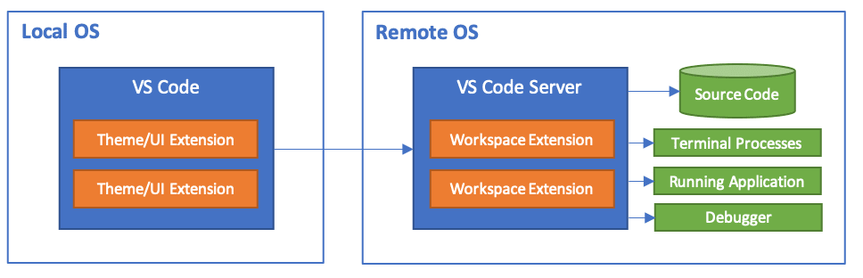

# VS Code Remote SSH

VS Code Remote SSH lets you open VS Code on your own computer, while the files, terminal, and commands are actually on the server.

It is great for everyday coding, editing configs, reading logs, and managing project files. If you are new to servers, it is usually much easier than editing files directly with `vim` or `nano` in a terminal.

One thing to keep in mind: VS Code Remote SSH does not turn the server into your local computer. It starts VS Code Server on the remote machine, and that can use some CPU, memory, and disk space. So it is good for development and light interaction, but not for running long training jobs directly. Long experiments should still use `tmux`.

## 1. Where Are You Actually Connected?

With Remote SSH, the VS Code window is shown on your own computer, but the important work happens on the remote server:

<figure markdown="span">
  { loading=lazy }
  <figcaption>VS Code Remote SSH architecture</figcaption>
</figure>

So when you delete, move, or overwrite files, be as careful as you would be in a server terminal.

## 2. First Make Sure Normal SSH Works

Remote SSH still uses SSH underneath. Many VS Code connection problems are actually normal SSH problems.

Before opening VS Code, first check from your local terminal that you can log in to the server:

```bash
ssh vis-server
```

If you have not configured the `vis-server` alias yet, read the previous page [SSH Public and Private Keys](../connecting-to-servers/ssh-key-pair.md), especially the `~/.ssh/config` section.

If `ssh vis-server` does not work in a normal terminal, VS Code Remote SSH usually will not work either. Fix the SSH connection first, then come back to this page.

## 3. Use SSH Config

VS Code can connect directly with `username@server-address`, but I recommend setting up SSH config first. Then your terminal, VS Code, `scp`, `rsync`, and other tools can all use the same connection information.

The local SSH config file is usually here:

=== "macOS / Linux"

    ```bash
    nano ~/.ssh/config
    ```

=== "Windows PowerShell"

    ```powershell
    notepad $env:USERPROFILE\.ssh\config
    ```

Example config:

```sshconfig
Host vis-server
    HostName 10.30.XXX.XXX
    User jie-zhang
    IdentityFile ~/.ssh/id_ed25519_vis
    ServerAliveInterval 60
    ServerAliveCountMax 3
```

What each line means:

| Config item | Meaning |
| --- | --- |
| `Host vis-server` | A local nickname for the server. Later you can run `ssh vis-server`. |
| `HostName 10.30.XXX.XXX` | The real server IP address or hostname. |
| `User jie-zhang` | Your server username. |
| `IdentityFile ~/.ssh/id_ed25519_vis` | The path to your local private key. |
| `ServerAliveInterval 60` | Send a keepalive signal every 60 seconds to reduce idle disconnects. |
| `ServerAliveCountMax 3` | Disconnect after 3 failed keepalive checks. |

After saving, test it first:

```bash
ssh vis-server
```

If you can enter the server normally, continue with VS Code.

## 4. Install VS Code and the Remote SSH Extension

Install these on your own computer:

1. [Visual Studio Code](https://code.visualstudio.com/)
2. VS Code extension: [Remote - SSH](https://marketplace.visualstudio.com/items?itemName=ms-vscode-remote.remote-ssh), published by Microsoft

How to install the extension:

1. Open VS Code;
2. Click the Extensions icon on the left;
3. Search for `Remote - SSH`;
4. Install the extension published by Microsoft.

{ loading=lazy }

You can also install Microsoft's **Remote Development** extension pack. It includes Remote SSH, WSL, Dev Containers, and a few related extensions. For this page, installing Remote SSH alone is enough.

!!! note "Windows users"

    On Windows, I recommend using the built-in OpenSSH Client and first checking in PowerShell that `ssh vis-server` works. This makes it more stable when VS Code reads your SSH config.

## 5. First Connection from VS Code

After opening VS Code:

1. Press `Ctrl + Shift + P`. On macOS, you can also press `Command + Shift + P`;
2. Type and select `Remote-SSH: Connect to Host...`;
{ loading=lazy }
3. Select `vis-server`;
4. VS Code will open a new window;
5. If it asks for the server type, choose `Linux`;
6. The first time you connect, VS Code will install VS Code Server under your home directory on the server;
7. After connecting, the bottom-left corner usually shows `SSH: vis-server`.

After the connection is ready, open the integrated terminal:

```text
Terminal -> New Terminal
```

{ loading=lazy }

Run:

```bash
whoami
hostname
pwd
```

If the output shows your server username, the server hostname, and a server directory, you are now working in the remote environment.

## 6. Open the Right Project Folder

After Remote SSH connects, the next step is to open a project folder on the server.

I recommend keeping projects under a clean directory in your server home, for example:

```bash
mkdir -p ~/projects
```

Then in VS Code, choose:

```text
File -> Open Folder...
```

Common paths may look like:

```text
/home/jie-zhang/projects
/home/jie-zhang/projects/my-experiment
```

!!! warning "Do not casually open a huge directory"

    Do not directly open `/`, `/home`, a large dataset directory, or a directory with lots of experiment outputs.

    VS Code and some extensions may scan project files. If the directory contains many images, logs, model weights, or cache files, VS Code may become slow and may also add unnecessary load to the server.

A good habit is to open one project folder for one project. Put datasets, model weights, and large result directories outside the project folder, or exclude them through config.

## 7. Use the Remote Terminal in VS Code

In Remote SSH mode, VS Code's integrated terminal is the server terminal. You can run commands just like in a normal SSH session:

```bash
pwd
ls
nvidia-smi
python --version
```

If you use conda or venv, activate the environment in this terminal too:

```bash
conda activate your-env-name
```

For short tests, running directly in the VS Code terminal is fine:

```bash
python test.py
```

But for long training jobs, downloads, compression, or batch processing, do not rely only on the VS Code terminal. If the VS Code window closes, the network disconnects, or the remote connection drops, jobs in a normal terminal may be affected.

For long experiments, use `tmux`:

```bash
tmux new -s exp1
python train.py
```

Detach from tmux:

```text
Ctrl + B, then press D
```

Attach again later:

```bash
tmux attach -t exp1
```

This will be explained in more detail in [tmux and Running Experiments](../running-experiments/tmux-and-experiments.md).

## 8. VS Code Extensions Can Be Local or Remote

After connecting to a remote server, some extensions will ask to be installed in the remote environment, such as Python, Jupyter, C/C++, and GitLens. Extensions installed locally are not always available on the server side.

Extensions installed on the remote side run on the server, so they may use server resources.

I recommend installing only necessary extensions remotely. For example, for a Python project, Python and Jupyter are usually enough.

If an extension makes remote VS Code very slow, you can disable its remote SSH version from the Extensions page.

{ loading=lazy }

## 9. File Transfer

VS Code Remote SSH is convenient for editing server files. It can also drag and drop a small number of small files, such as code, config files, images, or documents. But it is not a large-scale file transfer tool.

For datasets, model weights, large archives, and other big files, do not use VS Code as the main transfer method. Use `scp`, `rsync`, SFTP, or a dedicated sync tool instead. We will cover this in [File Transfer](./file-transfer.md).

## References

- [Visual Studio Code: Remote Development using SSH](https://code.visualstudio.com/docs/remote/ssh)
- [Santa Clara University: HPC Access via VSCode](https://www.scu.edu/wave/wave-hpc/getting-started/hpc-access-via-vscode/)
- [Caltech HPC Center: VSCode](https://www.hpc.caltech.edu/documentation/software-and-modules/vscode)
- [Princeton Research Computing: Visual Studio Code](https://researchcomputing.princeton.edu/support/knowledge-base/vs-code)
- [NYU Abu Dhabi CRC: Connecting VS Code to HPC using SSH](https://crc-docs.abudhabi.nyu.edu/hpc/system/vscode.html)
