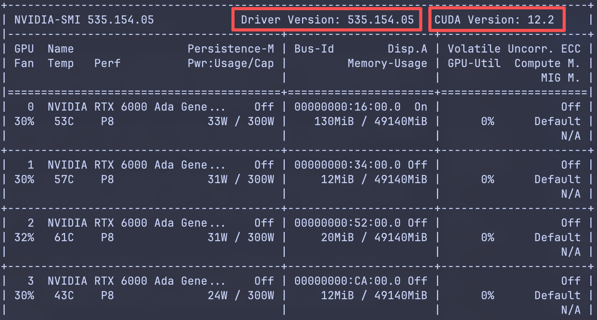

# Python Environment Isolation

This page explains how to install Miniforge3 on the lab server and use conda to create isolated Python environments for different experiments.

Do not rely on the system Python for experiments. Use a separate environment for each project. Prefer conda for dependency management.

<figure markdown="span">
  { loading=lazy, width="60%" }
  <figcaption>https://programmerhumor.io/python-memes/gis-and-ml-is-a-whole-new-world-of-hurt/</figcaption>
</figure>

!!! note "Miniforge or Miniconda?"

    This guide uses Miniforge3 consistently. Miniforge uses `conda-forge` by default, while Miniconda uses Anaconda's default package channels. Both are lightweight Conda distributions, but this guide chooses Miniforge because it is community-developed and avoids commercial licensing concerns.

    If your computer already has Miniconda installed, you do not need to replace it immediately. Most conda commands still apply.

    Do not install both Miniforge and Miniconda at the same time, and do not casually mix different package channels in the same environment.

    **If you are not sure which one to use, use Miniforge.**

## 1. Why Environment Isolation Matters

Different experiments may require completely different Python and package versions. For example:

```text
project-a needs Python 3.10 + torch 2.4
project-b needs Python 3.11 + torch 2.6
project-c needs an older numpy
```

The correct habit is: one project corresponds to one conda environment.

## 2. Check the Default Server Environment First

After logging in, first check the environment:

```bash
uname -m
cat /etc/os-release | sed -n '1,8p'
python3 --version
python3 -m pip --version
command -v conda
conda --version
```

For a default server environment, log would like:

```text
x86_64
Ubuntu 24.04.3 LTS
Python 3.12.3
/usr/bin/python3: No module named pip
conda: command not found
```

This means the server has a system Python, but Miniforge / conda is not prepared by default. The system Python is for the operating system, and regular users do not have permission to modify it.

!!! warning "Do not modify system Python"

    Do not use system Python as your experiment environment. Regular users do not have sudo permission. Experiment dependencies should go into your own Miniforge / conda environment.

If you type `pip` directly, you may see a message like:

```text
コマンド 'pip' が見つかりません。次の方法でインストールできます:
apt install python3-pip
管理者に確認してください。
```

This means the system-level `pip` command is not installed. For experiment users, the right solution is not `apt install python3-pip`, but installing and using your own Miniforge.

## 3. Install Miniforge

Miniforge is a lightweight conda distribution that uses `conda-forge` by default. Compared with the full Anaconda distribution, it is a better fit for personal experiment environment management.

Install it under your home directory:

```text
~/opt/miniforge3
```

Download the installer:

```bash
mkdir -p ~/opt
cd ~/opt
curl -L -O https://github.com/conda-forge/miniforge/releases/latest/download/Miniforge3-Linux-x86_64.sh
```

Run the automatic installation:

```bash
bash Miniforge3-Linux-x86_64.sh -b -p ~/opt/miniforge3
```

Check the result:

```bash
~/opt/miniforge3/bin/conda --version
~/opt/miniforge3/bin/python --version
```

If you see output like this, the installation succeeded:

```bash
jie-zhang@Ubuntu:~/opt$ ~/opt/miniforge3/bin/conda --version
conda 26.3.2
jie-zhang@Ubuntu:~/opt$ ~/opt/miniforge3/bin/python --version
Python 3.13.13
```

## 4. Enable conda

After installation, the current shell may not know where `conda` is. Load it manually first:

```bash
source ~/opt/miniforge3/etc/profile.d/conda.sh
```

Then check:

```bash
conda --version
```

## 5. Should You Write It into ~/.bashrc? Recommended

If you want to use `conda activate` directly every time you log in, run:

```bash
~/opt/miniforge3/bin/conda init bash
```

Then open a new SSH terminal, or run:

```bash
source ~/.bashrc
```

It is recommended to disable automatic activation of `base`:

```bash
conda config --set auto_activate false
```

> Older conda command: `conda config --set auto_activate_base false`

This keeps your terminal cleaner because `(base)` will not appear automatically after login.

For beginners, running `conda init` is recommended. If you do not want to modify `~/.bashrc`, you can also manually run this line every time:

```bash
source ~/opt/miniforge3/etc/profile.d/conda.sh
```

## 6. Create a Project Environment

It is best to keep the environment name consistent with the project name. For example, if the project is called `nerf-room1`:

```bash
conda create -n nerf-room1 python=3.11 -y
conda activate nerf-room1
```

Confirm where the current Python comes from:

```bash
which python
python --version
```

The output should look similar to:

```bash
(nerf-room1) jie-zhang@Ubuntu:~$ which python
/home/jie-zhang/opt/miniforge3/envs/nerf-room1/bin/python
(nerf-room1) jie-zhang@Ubuntu:~$ python --version
Python 3.11.15
```

!!! warning "Do not install dependencies into base"

    `base` should only provide environment management tools such as `conda`. Dependencies needed by training code, such as `torch`, `tensorflow`, `opencv`, and `numpy`, should go into the project's own environment.

## 7. Install Project Dependencies

Prefer conda for complex dependencies:

```bash
conda install numpy pandas matplotlib -y
```

If the project provides `requirements.txt` and you have already activated the project environment:

```bash
python -m pip install -r requirements.txt
```

If you only need to install one temporary pip package, still prefer:

```bash
python -m pip install package-name
```

This ensures that `pip` belongs to the currently activated Python environment.

!!! warning "Do not run pip install outside an environment"

    Do not run `pip install` before activating the conda environment.

    Do not run `pip install` before activating the conda environment.

    Do not run `pip install` before activating the conda environment.

## 8. Use a Specific CUDA Toolkit Version in a conda Environment

The lab servers are shared by multiple users. Do not try to install or modify CUDA at the OS level yourself. Global changes to `/usr/local/cuda`, system environment variables, or driver-related components may affect experiments that other students are currently running.

A safer approach is to install the CUDA Toolkit or deep learning framework CUDA version required by your project inside your own conda environment. This allows different projects to use different CUDA-related dependencies without modifying the system-wide environment.

!!! note "CUDA Toolkit is not the NVIDIA driver"

    The `cuda-toolkit` installed inside a conda environment mainly provides compiler tools, header files, and user-space libraries, such as `nvcc`. The GPU driver is still a system-level component and should be maintained by the administrator.

    If the server's system driver is too old, a newer CUDA Toolkit installed inside a conda environment may still fail to run the corresponding GPU program.

If you only need to install frameworks such as PyTorch or TensorFlow, usually check the framework's official installation command first. For example, PyTorch provides installation commands for different CUDA versions. Do not blindly install a system-level CUDA first.

If your project needs `nvcc`, for example to compile a CUDA extension, install a package that requires local CUDA compilation, or satisfy a course / code requirement for a specific CUDA Toolkit version, install the specified version inside the activated project environment.

For example, create an environment that needs CUDA 11.6:

```bash
conda create -n cuda116-demo python=3.10 -y
conda activate cuda116-demo
```

Install CUDA 11.6 Toolkit in this environment:

```bash
conda install -c nvidia/label/cuda-11.6.2 cuda-toolkit
```

After installation, check:

```bash
which nvcc
nvcc -V
```

If you see output similar to the following, the `nvcc` in the current conda environment is CUDA 11.6:

```text
nvcc: NVIDIA (R) Cuda compiler driver
Copyright (c) 2005-2022 NVIDIA Corporation
Built on Tue_Mar__8_18:18:20_PST_2022
Cuda compilation tools, release 11.6, V11.6.124
Build cuda_11.6.r11.6/compiler.31057947_0
```

It is also recommended to check the system GPU and driver status:

```bash
nvidia-smi
```

<figure markdown="span">
    { loading=lazy, width="80%" }
</figure>

Note that the `CUDA Version` shown by `nvidia-smi` means the highest CUDA runtime version supported by the current system driver. It is not necessarily the same as the CUDA Toolkit version shown by `nvcc -V` inside your current conda environment. To determine the Toolkit version of the current environment, use `which nvcc` and `nvcc -V`.

After logging in to the server again, reactivate the environment:

```bash
source ~/opt/miniforge3/etc/profile.d/conda.sh
conda activate cuda116-demo
```

If you have already run `conda init bash` and opened a new terminal, you can usually run:

```bash
conda activate cuda116-demo
```

## 9. Run Experiments

Before starting an experiment, get into the habit of checking:

```bash
whoami
hostname
pwd
nvidia-smi
```

Enter the project directory, enable Miniforge, and activate the project environment:

```bash
cd ~/projects/nerf-room1
source ~/opt/miniforge3/etc/profile.d/conda.sh
conda activate nerf-room1
which python
```

Then run training:

```bash
python train.py
```

With `tmux` and logs, a recommended command is:

```bash
mkdir -p logs
python train.py 2>&1 | tee "logs/train_$(date +%Y%m%d_%H%M%S).log"
```

For how to keep long-running experiments alive, see [tmux and Running Experiments](tmux-and-experiments.md).

## 10. Export and Reproduce an Environment

If you want others to reproduce your experiment, export an environment file:

```bash
conda activate nerf-room1
conda env export --from-history > environment.yml
```

`--from-history` records only the packages you explicitly installed, so the file is usually cleaner.

Others can reproduce it with:

```bash
source ~/opt/miniforge3/etc/profile.d/conda.sh
conda env create -f environment.yml
conda activate nerf-room1
```

If the project mainly uses `pip` packages, you can also record:

```bash
python -m pip freeze > requirements.txt
```

For complex dependencies such as CUDA, PyTorch, and OpenCV, conda is usually the better choice.

## 11. Use with VS Code Remote SSH

After opening the project through VS Code Remote SSH, if the Python extension does not automatically detect the environment, select the interpreter manually:

```text
Command Palette -> Python: Select Interpreter
```

Choose a path like:

```text
/home/your-name/opt/miniforge3/envs/nerf-room1/bin/python
```

If the VS Code terminal still cannot use `conda activate`, run:

```bash
source ~/opt/miniforge3/etc/profile.d/conda.sh
conda activate nerf-room1
```

## 12. Disk Usage and Cleanup

conda environments can be large. A deep learning environment using several GB is common. Check disk usage regularly:

```bash
du -sh ~/opt/miniforge3
conda env list
```

Remove an environment you no longer use:

```bash
conda remove -n nerf-room1 --all -y
```

Clean downloaded package caches:

```bash
conda clean -a
```

## 13. FAQ

### I Accidentally Installed Packages into base

Stop installing more packages into `base`. For future projects, create a project environment:

```bash
conda create -n my-project python=3.11 -y
conda activate my-project
```

If `base` has become messy, do not manually delete files inside it at random. Ask an administrator or an experienced lab member first.

### Uninstall Miniforge

If you previously ran `conda init bash`, reverse the shell initialization first:

```bash
~/opt/miniforge3/bin/conda init --reverse bash
```

Then remove the installation directory:

```bash
rm -rf ~/opt/miniforge3
```

If the reverse command is unavailable, manually edit `~/.bashrc` and remove the conda initialization block. Confirm the path before deleting anything.

## References

- [Princeton Research Computing: Python](https://researchcomputing.princeton.edu/support/knowledge-base/python)
- [Harvard FASRC: Python Programming Language](https://docs.rc.fas.harvard.edu/kb/python/)
- [NIH Biowulf: Conda on Biowulf](https://hpc.nih.gov/docs/diy_installation/conda.html)
- [University of Florida Research Computing: Computation](https://docs.rc.ufl.edu/quickstart/computation/)
- [Yale Center for Research Computing: Jupyter Conda Environments](https://docs.ycrc.yale.edu/clusters-at-yale/access/ood-jupyter/)
- [conda-forge/miniforge](https://github.com/conda-forge/miniforge)
- [NVIDIA CUDA Installation Guide for Linux: Conda Installation](https://docs.nvidia.com/cuda/cuda-installation-guide-linux/index.html)
- [NVIDIA cuda-toolkit on Anaconda.org](https://anaconda.org/nvidia/cuda-toolkit)
- [PyTorch: Get Started Locally](https://pytorch.org/get-started/locally/)
