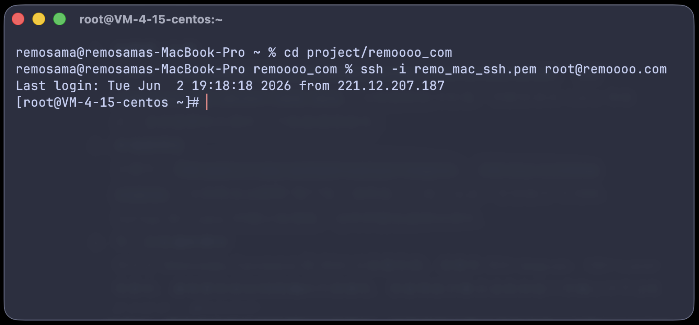

# SSH とは何か、接続方法

Before using the VIS Hiroshima lab's Ubuntu servers, you need to know two things:

1. How to connect to a server with SSH;
2. How to use basic Linux/UNIX commands.

This page first explains what SSH does, then walks through one basic server login. Later pages will cover SSH keys, VS Code Remote SSH, file transfer, and running long experiments.

{ loading=lazy }

## 1. Basic Idea of SSH

SSH stands for **Secure Shell**. It is a network protocol for logging in to another computer remotely, and it creates an encrypted connection between your computer and the remote server.

In our case, the lab's Ubuntu machine is the server. SSH connects your own computer to that server. After connecting, you can browse files on the server, create and edit code, run programs, use the server's GPU resources, download experiment results, and so on.

After you log in, you are still typing commands on your own computer, but those commands are actually running on the remote server. SSH encrypts the communication, including usernames, passwords, commands, and transferred data, so it is very useful for research and server work.

## 2. Do You Need to Install SSH?

Depending on your operating system, you may already have an SSH client ready to use.

=== "macOS"

    Mac usually comes with the command-line SSH tool already installed. You do not need extra setup. I recommend using Ghostty, iTerm2, or the built-in Terminal.

    Open a terminal and run:

    ```bash
    ssh -V
    ```

    If you see SSH version information, SSH is ready to use.

=== "Windows"

    Windows usually comes with OpenSSH Client already installed. I recommend using PowerShell.

    Open PowerShell and run:

    ```powershell
    ssh -V
    ```

    If you see SSH command information, the SSH client is installed.

    If Windows says it cannot find the `ssh` command, check "Optional Features" and make sure **OpenSSH Client** is installed.

=== "Linux"

    Most Linux distributions already come with OpenSSH Client installed. I recommend using the default terminal, or Ghostty if you prefer it.

    Open a terminal and run:

    ```bash
    ssh -V
    ```

    If you see SSH version information, SSH is ready to use.

    If your system says it cannot find the `ssh` command, install it with your distribution's package manager. On Ubuntu / Debian:

    ```bash
    sudo apt update
    sudo apt install openssh-client
    ```

    On Fedora:

    ```bash
    sudo dnf install openssh-clients
    ```

    On Arch Linux:

    ```bash
    sudo pacman -S openssh
    ```

## 3. What You Need Before Connecting

Before connecting to a lab server, you need to get **your username from Hirakiuchi-san, the lab server IP address or hostname, and the password for that account**.

Server accounts are usually provided by Hirakiuchi-san or another server administrator.

Hirakiuchi-san may send you something like this:

```text
Blackwell:10.30.XXX.XXX
アカウント名：jie-zhang
パスワード：今日の日付（8桁の数字）
```

Here, `10.30.XXX.XXX` is the server's IP address inside the lab network.

## 4. Connect from the Lab Network

If your computer is already connected to the lab's wired or wireless network, you can try connecting to the server directly with SSH.

The basic SSH command looks like this:

```bash
ssh username@server-address
```

For example:

```bash
ssh jie-zhang@10.30.XXX.XXX
```

The first time you connect to a server, SSH may show a message like this:

```text
The authenticity of host '10.30.XXX.XXX' can't be established.
Are you sure you want to continue connecting (yes/no/[fingerprint])?
```

This means your computer has never connected to this server before, so it has not saved the server's identity yet. Type `yes` and press Enter.

After that, the server information will be saved in your local `known_hosts` file. The next time you connect to the same server, this message usually will not appear again.

## 5. Enter the Password

After you run the SSH command, the terminal will ask for the password:

```text
jie-zhang@10.30.XXX.XXX's password:
```

Type the server password provided by Hirakiuchi-san, then press Enter.

> **Note: nothing appears while you type the password**
>
> When you type a password in the command line, the screen will not show stars, dots, or the password characters. This is normal.
>
> Just type the password and press Enter. If you think you typed it wrong, press `Ctrl + C` to cancel the current connection, then run the SSH command again.

## 6. How to Check That Login Worked

Here is a full example of an SSH login:

```text
user@DESKTOP-TRQ9UD0 C:\Users\user>ssh jie-zhang@10.30.XXX.XXX
jie-zhang@10.30.XXX.XXX's password:
Welcome to Ubuntu 24.04.3 LTS (GNU/Linux 6.8.0-85-generic x86_64)

 * Documentation:  https://help.ubuntu.com
 * Management:     https://landscape.canonical.com
 * Support:        https://ubuntu.com/pro

 System information as of 2026年  6月  7日 日曜日 22:47:44 JST

  System load:           2.31
  Usage of /:            11.4% of 13.97TB
  Memory usage:          13%
  Swap usage:            1%
  Temperature:           47.0 C
  Processes:             618
  Users logged in:       4
  IPv4 address for eno1: 10.30.XXX.XXX
  IPv6 address for eno1: 2001:2f8:xxx:xxx::xxxx

Expanded Security Maintenance for Applicationsが無効化されています。

112のアップデートはすぐに適用されます。
これらの更新の63は、標準のセキュリティ更新です。

Last login: Sun Jun  7 20:40:49 2026 from 2001:2f8:1c1:c39::480d
```

From this point on, the commands you type will run on the lab server, not on your own computer.

For example, `pwd` shows your current directory.

`ls` shows the files in the current directory.

`whoami` shows the username you are currently logged in as.

`hostname` shows the current server's hostname.

`nvidia-smi` shows the current GPU usage.

## 7. How to Leave the Server

Type `exit` in the command line and press Enter to close the current SSH session.

Closing the terminal window usually also disconnects you, but it is better to get into the habit of using `exit`.

If you run a long program directly in a normal SSH window, the program may stop when the SSH connection closes. Long-running experiments should use `tmux`. See [tmux and Running Experiments](../running-experiments/tmux-and-experiments.md) for details.

## 8. Common Connection Errors

### `Connection timed out`

If you see:

```text
ssh: connect to host 10.30.XXX.XXX port 22: Connection timed out
```

it means your computer cannot reach the server. Common reasons include not being on the lab network, being at home or on another off-campus network, or typing the IP address incorrectly.

First check whether you are on the lab network. If you are off campus, see [Off-campus Access](off-campus-access.md).

### `Permission denied, please try again.`

If you see:

```text
Permission denied, please try again.
```

it usually means the username or password is wrong. If you forgot your password, just contact Hirakiuchi-san.

### `Could not resolve hostname`

If you see:

```text
ssh: Could not resolve hostname ...
```

it usually means the server address is wrong. If you are using an IP address, check whether any numbers or dots are missing.

## 9. Basic Security Notes

Please follow these rules:

- Do not tell other people your password;
- Do not publish your password anywhere;
- Do not use `sudo` if you do not understand what the command does. In fact, you cannot use it on the server anyway, because Hirakiuchi-san did not give you that permission. :)

Later, you can set up SSH key login. With an SSH key, you usually do not need to type the server password every time, and it is nicer for long-term use. See [SSH Public and Private Keys](ssh-key-pair.md) for the steps.

## 10. What You Should Know After This Page

After finishing this page, you should be able to:

- Explain what SSH is for;
- Understand the difference between your local computer and a remote server;
- Connect to a lab server with `ssh username@server-address`;
- Leave the server properly with `exit`;

The most basic full workflow is:

```bash
ssh jie-zhang@10.30.XXX.XXX
```

After typing the password and logging in:

```bash
whoami
hostname
pwd
ls
```

When you are done:

```bash
exit
```

## References

- [Princeton University - Connect by SSH](https://researchcomputing.princeton.edu/support/knowledge-base/connect-ssh)
- [Florida State University - Using SSH](https://docs.rcc.fsu.edu/ssh/)
- [University of Michigan - Get Connected](https://documentation.its.umich.edu/node/5093)
