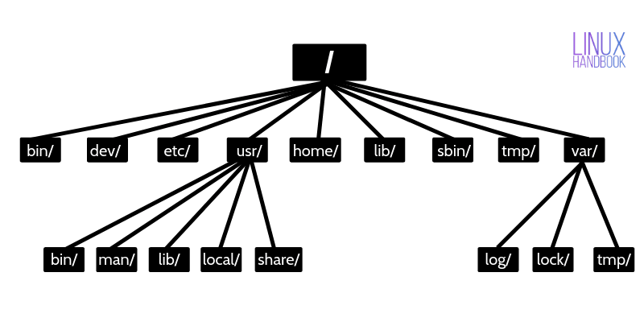

# よく使う Linux コマンド

This page collects some Linux commands you will use often on VIS Lab servers.

<figure markdown="span">
  { loading=lazy }
  <figcaption>sudo rm -rf</figcaption>
</figure>

## 1. Check Where You Are

Right after logging in to a server, it is a good idea to confirm your user, server, and current directory.

| Command | What it does |
| --- | --- |
| `whoami` | Shows your login username. |
| `hostname` | Shows the server hostname. |
| `pwd` | Shows the current directory. |
| `ls` | Lists files in the directory. |
| `ls -lh` | Shows file sizes. |
| `ls -la` | Also shows hidden files. |
| `history` | Shows recently used commands. |

A common check after login:

```bash
whoami
hostname
pwd
ls -lh
```

## 2. Move Between Directories

| Command | What it does |
| --- | --- |
| `cd folder_name` | Enter a directory. |
| `cd ..` | Go up one level. |
| `cd ~` | Go back to your home directory. |
| `cd -` | Go back to the previous directory. |
| `cd /absolute/path` | Enter an absolute path. |

If a path has spaces, wrap it in quotes:

```bash
cd "folder with spaces"
```

## 3. Basic File and Folder Operations

| Command | What it does |
| --- | --- |
| `mkdir folder_name` | Create a folder. |
| `mkdir -p path/to/folder` | Create nested folders; missing parent folders are created too. |
| `touch file.txt` | Create an empty file, or update its timestamp. |
| `cp source.txt target.txt` | Copy a file. |
| `cp -r source_folder target_folder` | Copy a folder. |
| `mv old_path new_path` | Move a file or folder. |
| `mv old_name.txt new_name.txt` | Rename a file. |
| `rm file.txt` | Delete a file. |
| `rm -r folder_name` | Delete a folder. |

!!! danger "`rm` usually cannot be undone"

    `rm` does not move files to the trash. Before running it, at least run:

    ```bash
    pwd
    ls -lh
    ```

    Confirm which directory you are in and what you are about to delete.

    Be especially careful with commands like:

    ```bash
    rm -rf folder_name
    rm -rf *
    ```

    On a shared server, do not run `rm -rf` if you do not understand the path, and do not delete other people's directories.

    <figure markdown="span">
        { loading=lazy }
        <figcaption>linux-directory-structure</figcaption>
    </figure>

## 4. View File Contents

| Command | What it does |
| --- | --- |
| `cat file.txt` | Print the whole file at once. Good for small files. |
| `less file.txt` | View a file page by page. Good for large files; press `q` to quit. |
| `head file.txt` | Show the beginning of a file. |
| `head -n 20 file.txt` | Show the first 20 lines. |
| `tail file.txt` | Show the end of a file. |
| `tail -n 50 file.txt` | Show the last 50 lines. |
| `tail -f log.txt` | Watch log updates in real time. |

When training models, checking logs is very common:

```bash
tail -f train.log
```

Press `Ctrl + C` to leave `tail -f`.

## 5. Search Files and Text

Find Python files under the current directory:

```bash
find . -name "*.py"
```

Find files whose names contain `config`:

```bash
find . -iname "*config*"
```

Search text under the current directory:

```bash
grep -R "learning_rate" .
```

Search only in Python files:

```bash
grep -R "learning_rate" --include="*.py" .
```

If `rg` is installed on the server, you can also use ripgrep. It is usually faster:

```bash
rg "learning_rate"
```

## 6. Edit Text Files

Common command-line text editors on servers include `nano`, `vim`, and `emacs`. If you are not familiar with terminal editors at all, I recommend using VS Code Remote SSH first.

For beginners, `nano` is the easiest one to start with:

```bash
nano file.txt
```

In `nano`:

| Action | Shortcut |
| --- | --- |
| Save | `Ctrl + O`, then press Enter |
| Exit | `Ctrl + X` |
| Cancel current action | `Ctrl + C` |

## 7. Check Disk and Directory Usage

Check server disk partition usage:

```bash
df -h
```

Check the size of the current directory:

```bash
du -sh .
```

Check the size of each item in the current directory:

```bash
du -sh *
```

Show current directory contents sorted by size:

```bash
du -sh -- ./* ./.??* 2>/dev/null | sort -hr
```

## 8. Check CPU, Memory, and Processes

| Command | What it does |
| --- | --- |
| `lscpu` | Shows CPU model and core information. |
| `top` | Shows current CPU, memory, and process usage. |
| `htop` | A more visual CPU, memory, and process view; it may not be installed on every server. |
| `free -h` | Shows overall memory usage. |
| `ps -u $USER` | Shows processes currently running under your user. |
| `ps aux` | Shows the process list on the system. |

Search by process name:

```bash
ps aux | grep python
```

View details for one process:

```bash
ps -fp PID
```

Replace `PID` with the actual process ID.

Stop a process you started:

```bash
kill PID
```

If normal `kill` does not work, and you have confirmed the process is yours and should be stopped, use:

```bash
kill -9 PID
```

## 9. Check GPU Usage

Deep learning and graphics computing tasks usually need GPUs. Before starting training, first check whether the GPU is free, so you do not accidentally take resources someone else is using.

Check GPU status:

```bash
nvidia-smi
```

Refresh once per second:

```bash
watch -n 1 nvidia-smi
```

For more rules about shared GPU usage, see [GPU / Disk / Memory Guidelines](../running-experiments/resource-guidelines.md).

## 10. Check Current Login Users

| Command | What it does |
| --- | --- |
| `who` | Shows users currently logged in to the server. |
| `w` | Shows logged-in users and what they are running. |
| `last` | Shows recent login records. |

These commands help you check whether other people are using the server.

## 11. Compress and Extract Files

Extract a `.zip` file:

```bash
unzip file.zip
```

Create a `.zip` archive:

```bash
zip -r archive.zip folder_name
```

Extract a `.tar.gz` file:

```bash
tar -xzf archive.tar.gz
```

Create a `.tar.gz` archive:

```bash
tar -czf archive.tar.gz folder_name
```

See what is inside a `.tar.gz` file:

```bash
tar -tzf archive.tar.gz | head
```

## 12. Permission Commands

View file permissions:

```bash
ls -l file.txt
```

Make a script executable:

```bash
chmod +x run.sh
```

Fix SSH private key permissions:

```bash
chmod 600 ~/.ssh/id_ed25519_vis
```

Fix `.ssh` directory and `authorized_keys` permissions:

```bash
chmod 700 ~/.ssh
chmod 600 ~/.ssh/authorized_keys
```

!!! warning "Do not casually use `chmod -R 777`"

    `chmod -R 777` makes files under a directory readable, writable, and executable by everyone. On a shared server, this is usually not what you want. If you run into permission problems, first check who owns the file, where you are, and which permissions really need to be opened.

## 13. Useful Command-line Tips

| Command or symbol | What it does |
| --- | --- |
| `Ctrl + C` | Interrupt the command currently running in the foreground. |
| `Ctrl + L` | Clear the screen. |
| `Tab` | Auto-complete a command or path. |
| `Up` / `Down` | View the previous or next command. |
| `command > out.txt` | Write output to a file, overwriting old content. |
| `command >> out.txt` | Append output to the end of a file. |
| `command 2> err.txt` | Write error messages to a file. |
| `command --help` | Show command help. |
| `man command` | Show the command manual; press `q` to quit. |

Show training output on the screen and write it to a log file at the same time:

```bash
python train.py 2>&1 | tee train.log
```

Append to an existing log:

```bash
python train.py 2>&1 | tee -a train.log
```

## References

- [The University of Sheffield - Quick Reference (Cheat Sheets)](https://docs.hpc.shef.ac.uk/en/latest/cheatsheets/index.html)
- [Abhishek Prakash - Linux Jargon Buster](https://itsfoss.com/sudo-rm-rf/)
- [University of Wisconsin - Basic shell commands](https://chtc.cs.wisc.edu/uw-research-computing/basic-shell-commands)
- [Abhishek Prakash - Linux Directory Structure Explained for Beginners](https://linuxhandbook.com/linux-directory-structure)
