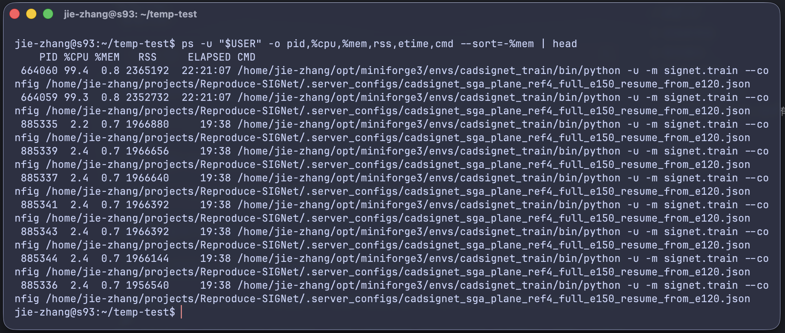

# GPU / ストレージ / メモリ利用規則

Lab servers are shared resources. One person's program can use not only GPU, but also CPU, memory, disk space, and disk I/O.

Most commands in this page can also be found in [Common Linux Commands](../daily-remote-workflow/linux-commands.md).

## 1. Checklist Before Running

Before starting training or any long-running task, run:

```bash
whoami
hostname
pwd
```

Confirm which account, server, and directory you are using.

Check GPU:

```bash
nvidia-smi
```

Check logged-in users:

```bash
who
```

Check system memory:

```bash
free -h
```

Check current directory size:

```bash
du -sh .
```

Check overall disk usage:

```bash
df -h
```

**If these commands show that the server is already busy, do not immediately start another heavy job. First make sure it will not affect others.**

## 2. GPU Guidelines

GPU is the most visible shared resource, and also the easiest one to conflict over. Before training, always check:

```bash
nvidia-smi
```

Pay attention to `GPU-Util` and `Memory-Usage`.

If a GPU already has another lab member's process on it, do not take it directly. Even if `GPU-Util` is temporarily 0%, the job may simply be loading data, validating, saving a checkpoint, or waiting for the next training step.

If the server has multiple GPUs, you can choose which one to use. For example, use only GPU 0:

```bash
CUDA_VISIBLE_DEVICES=0 python train.py
```

Use only GPU 1:

```bash
CUDA_VISIBLE_DEVICES=1 python train.py
```

!!! warning "Do not start with multiple GPUs right away"

    Multiple GPUs do not automatically make every program faster. Many codebases need DataParallel, DistributedDataParallel, or other multi-GPU logic.

    I recommend first running a small experiment on one GPU. After confirming memory usage, speed, and logs are normal, then consider multiple GPUs.

## 3. CPU and System Memory

GPU training also uses CPU and system memory.

Check memory:

```bash
free -h
```

I like using `htop`:

```bash
htop
```

Check processes under your own account:

```bash
ps -u "$USER" -o pid,%cpu,%mem,rss,etime,cmd --sort=-%mem | head
```

{ loading=lazy }

When using frameworks such as PyTorch or TensorFlow, do not casually set `num_workers` very high. For example:

```python
num_workers=32
```

This may use a lot of CPU and memory. Start from `2`, `4`, or `8`, then adjust after observing speed and memory usage.

## 4. Disk Space

Training outputs, checkpoints, datasets, and similar files can easily fill the disk. When the disk is full, experiments may fail, and in worse cases other users may also be affected.

Check overall filesystem space:

```bash
df -h
```

Check current directory size:

```bash
du -sh .
```

Check the size of each item in the current directory, sorted by size:

```bash
du -sh -- ./* ./.??* 2>/dev/null | sort -hr
```

Find files larger than 1 GB under the current directory:

```bash
find . -type f -size +1G -exec ls -lh {} \;
```

Common things to clean regularly include old checkpoints and temporary files.

Do not use this if you are not sure where you are:

```bash
rm -rf *
```

## 5. Many Small Files

Many small files can slow down the filesystem. For example, if you put hundreds of thousands of images, log fragments, or intermediate outputs in one directory, reading, deleting, backing up, and syncing can all become slow.

A better approach is to split them by category, date, or ID range. You will notice that almost all large datasets are organized this way.

For example, this is not recommended:

```text
outputs/
  000000.png
  000001.png
  ...
  999999.png
```

This is better:

```text
outputs/
  000/
    000000.png
    000001.png
  001/
    001000.png
    001001.png
```

## 6. Disk I/O

Disk I/O means pressure from reading and writing disk. Even if the GPU is not full, the server can become slow if someone is extracting, copying, deleting, or reading lots of small files.

If you need to do large compression, extraction, or copying, try to avoid times when other lab members are training. Before operating, check the data size:

```bash
du -sh dataset/
```

If you are transferring many small files from your own computer to the server, it is better to compress them first and transfer one archive. See [File Transfer](../daily-remote-workflow/file-transfer.md).

## 7. After an Experiment Finishes

When an experiment finishes, do not just close your local computer. I recommend doing a few checks.

Check tmux sessions:

```bash
tmux ls
```

Exit sessions you no longer need:

```bash
exit
```

Check whether you still have running processes:

```bash
ps -u "$USER" -o pid,%cpu,%mem,etime,cmd
```

Check whether GPU has been released:

```bash
nvidia-smi
```

For important results, transfer them back to your own computer or another approved long-term storage location. Do not treat the server disk as your only backup.

## 8. Recommended Habits

Get into the habit of checking `nvidia-smi` before every training run. Also confirm `pwd` before starting each experiment.

Save logs for every experiment. Otherwise, a failed run may leave you with no clue.

Split or compress large numbers of small files.

Do not keep important results only on the server.

## References

- [UVA Research Computing: GPU Best Practices](https://www.rc.virginia.edu/userinfo/hpc/gpu-best-practices/)
- [Johns Hopkins ARCH: GPU Utilization](https://docs.arch.jhu.edu/en/latest/2_Common_Tasks/GPU_Computing.html)
- [Virginia Tech ARC: Acceptable Use Policy](https://www.docs.arc.vt.edu/usage/01-acceptable-use-policy.html)
- [University of Glasgow MARS: HPC Etiquette](https://mars.ice.gla.ac.uk/policies/hpc-etiquette/)
- [University of Arizona HPC: Standard Practices](https://hpcdocs.hpc.arizona.edu/policies/standard_practices/)
- [Sheffield HPC: GPU Computing](https://docs.hpc.shef.ac.uk/en/latest/parallel/GPUComputing.html)
- [TSUBAME4.0 FAQ](https://www.t4.cii.isct.ac.jp/docs/faq.ja/general/)
