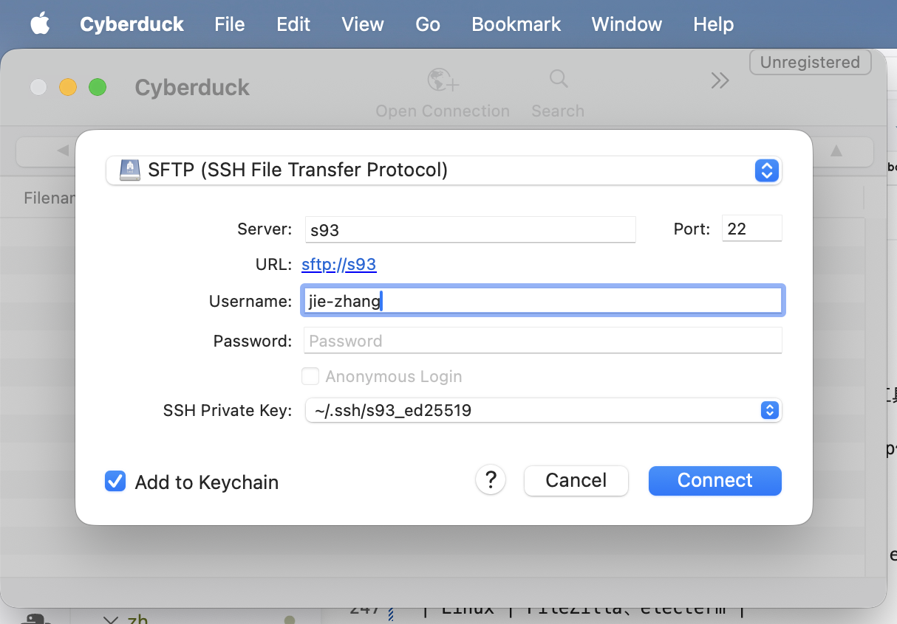
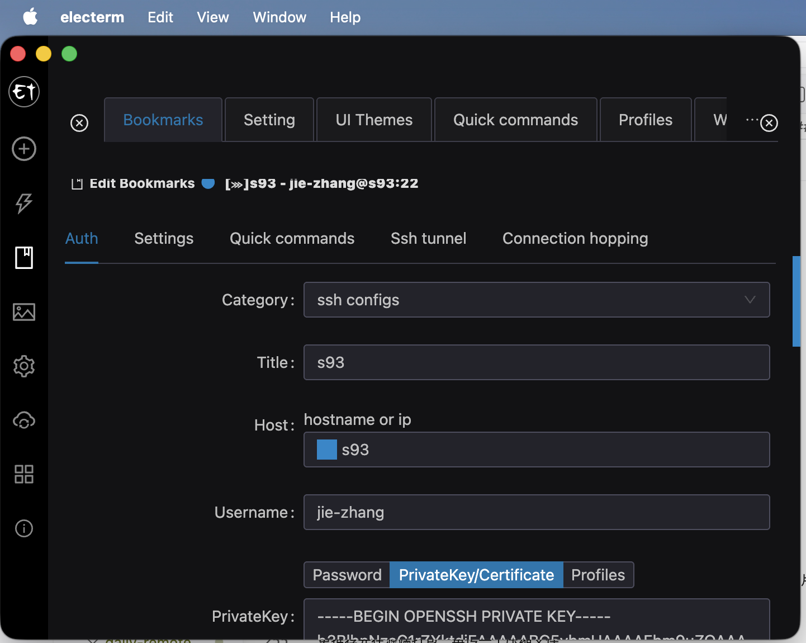

# 文件传输

本节介绍如何在自己的电脑和实验室服务器之间传输文件。

如果只是修改代码、配置文件、少量文本日志，可以直接用 VS Code Remote SSH。  
如果要传输数据集、模型权重、实验结果、大量图片或大型压缩包，最好使用 `scp`、`rsync`、`sftp` 等专门工具。

## 1. 先确认 SSH 可以连接

文件传输也可以通过 SSH 完成。因此，在传文件之前，先确认本机可以正常连接服务器：

```bash
ssh vis-server
```

如果你还没有配置 `vis-server` 这个别名，请先阅读 [SSH 私钥公钥](../connecting-to-servers/ssh-key-pair.md) 中的 `~/.ssh/config` 部分。

配置好以后，直接使用别名登陆就非常方便了。

```bash
ssh vis-server
scp local-file.txt vis-server:~/
rsync -av local-folder/ vis-server:~/local-folder/
sftp vis-server
```

## 2. 该用哪种方式

简单来说，小文件/文件夹用 `scp` 或者 vscode 。大型文件（如数据集、模型权重、大型结果等）且有断传风险的用 `rsync` 。 `sftp` 更像一个交互式文件管理器，适合边看目录边传。

!!! warning "先确认方向"

    明确是从本机传到服务器，还是从服务器下载到本机。

## 3. 路径的写法

传输命令里通常会同时出现本机路径和服务器路径。

本机当前目录可以写成：

```text
./
```

服务器路径通常写成：

```text
vis-server:/home/jie-zhang/projects/
```

如果使用 home 目录，可以简写成：

```text
vis-server:~/projects/
```

其中 `vis-server:` 前面是 SSH config 中的主机别名，冒号后面是服务器上的路径。

例如：

```bash
scp result.txt vis-server:~/projects/
```

表示把本机当前目录下的 `result.txt` 复制到服务器的 `~/projects/` 目录。

Windows PowerShell 中也可以使用类似写法。本机当前目录可以写成 `.\`，完整路径可能类似：

```powershell
scp .\result.txt vis-server:~/projects/
```

## 4. 使用 scp 复制文件

`scp` 适合传一个文件或一个不大的文件夹。

### 本机传到服务器

```bash
scp local-file.txt vis-server:~/projects/
```

例子：

```bash
scp config.yaml vis-server:~/projects/my-experiment/
```

### 服务器下载到本机

```bash
scp vis-server:~/projects/my-experiment/result.txt ./
```

最后的 `./` 表示下载到本机当前目录。

### 复制文件夹

复制文件夹需要加 `-r`：

```bash
scp -r local-folder vis-server:~/projects/
```

从服务器下载文件夹：

```bash
scp -r vis-server:~/projects/my-experiment/results ./
```

`scp` 的优点是简单。缺点是如果传输中断，通常需要重新传；如果目录很大，也不方便只传变化的文件。

## 5. 使用 rsync 同步目录

`rsync` 是更推荐的日常传输工具。它会比较源目录和目标目录，只传输新增或变化的部分。对于大目录、重复同步、中断后继续传输，通常比 `scp` 更合适。

macOS 和 Linux 通常可以直接使用 `rsync`。Windows PowerShell 默认一般没有 `rsync`，可以使用 WSL、Git Bash、Cygwin，或者改用 `scp`、`sftp`、WinSCP 等工具。

### 本机同步到服务器

```bash
rsync -av --progress local-folder/ vis-server:~/projects/local-folder/
```

### 服务器同步到本机

```bash
rsync -av --progress vis-server:~/projects/my-experiment/results/ ./results/
```

常用参数含义：

| 参数 | 含义 |
| --- | --- |
| `-a` | archive 模式，递归复制并尽量保留时间、权限等信息。 |
| `-v` | 显示详细信息。 |
| `--progress` | 显示传输进度。 |
| `--partial` | 保留未完成的部分文件，方便下次继续。 |
| `--dry-run` | 预演，不真正复制或删除文件。 |

推荐写法是：

```bash
rsync -av --progress --partial local-folder/ vis-server:~/projects/local-folder/
```

### 注意末尾的斜杠

`rsync` 中源目录末尾有没有 `/` 很重要。

```bash
rsync -av local-folder/ vis-server:~/projects/local-folder/
```

有 `/` 表示复制 `local-folder` 里面的内容。

```bash
rsync -av local-folder vis-server:~/projects/
```

没有 `/` 表示把整个 `local-folder` 文件夹复制到 `~/projects/` 下面。

如果不确定自己写得对不对，先加 `--dry-run`：

```bash
rsync -av --dry-run local-folder/ vis-server:~/projects/local-folder/
```

确认输出符合预期后，再去掉 `--dry-run`。

!!! danger "谨慎使用 --delete"

    `rsync --delete` 会删除目标目录中源目录没有的文件。这个参数很有用，但也很危险。

    如果方向写反，可能会把目标目录中的重要文件删掉。刚开始使用时，不建议使用 `--delete`。

## 6. 使用 sftp 交互式传输

`sftp` 适合你不太确定文件在哪，想进入一个交互式界面边看边传。

连接服务器：

```bash
sftp vis-server
```

进入后会看到：

```text
sftp>
```

常用命令：

| 命令 | 作用 |
| --- | --- |
| `pwd` | 查看服务器当前目录。 |
| `lpwd` | 查看本机当前目录。 |
| `ls` | 查看服务器目录内容。 |
| `lls` | 查看本机目录内容。 |
| `cd path` | 切换服务器目录。 |
| `lcd path` | 切换本机目录。 |
| `put file.txt` | 从本机上传文件到服务器。 |
| `get file.txt` | 从服务器下载文件到本机。 |
| `put -r folder` | 上传文件夹。 |
| `get -r folder` | 下载文件夹。 |
| `bye` | 退出。 |

例子：

```text
sftp> cd projects/my-experiment
sftp> lcd Downloads
sftp> put config.yaml
sftp> get result.txt
sftp> bye
```

## 7. 图形界面工具

如果你不想每次都写命令，也可以使用支持 SFTP 的图形工具。

市面上大多数的工具都差不多，我们只需要找支持SSH/sftp传输的就可以了。

| 系统 | 工具 |
| --- | --- |
| Windows | Cyberduck、FileZilla、MobaXterm、electerm |
| macOS | Cyberduck、FileZilla、electerm |
| Linux | FileZilla、electerm |

{ loading=lazy }

{ loading=lazy }


## 8. 大量小文件先打包

大量小文件传输通常会很慢，因为每个文件都需要单独处理元数据。比如几万张图片、很多日志碎片、小型缓存文件，直接传目录可能很耗时。

更推荐先在源端打包，再传一个压缩文件。

### 在服务器上打包

```bash
tar -czf results.tar.gz results/
```

下载到本机：

```bash
scp vis-server:~/projects/my-experiment/results.tar.gz ./
```

### 在本机打包后上传

```bash
tar -czf dataset-small.tar.gz dataset-small/
scp dataset-small.tar.gz vis-server:~/datasets/
```

### 解压

```bash
tar -xzf results.tar.gz
```

!!! note "压缩也会消耗资源"

    在服务器上压缩大型目录会占用 CPU 和硬盘 I/O。共享服务器上不要反复压缩特别大的目录，最好先确认目录大小，并避开其他同学正在重度使用服务器的时间。

查看目录大小：

```bash
du -sh results/
```

## 9. 排除不需要传的文件

同步项目时，很多文件其实不需要传，比如 Python 缓存、Git 目录、临时日志、模型 checkpoint、wandb 输出等。

可以用 `--exclude` 排除：

```bash
rsync -av --progress \
  --exclude ".git/" \
  --exclude "__pycache__/" \
  --exclude "*.pyc" \
  local-folder/ vis-server:~/projects/local-folder/
```

如果排除规则很多，可以写到一个文件里，例如 `rsync-exclude.txt`：

```text
.git/
__pycache__/
*.pyc
wandb/
runs/
checkpoints/
```

然后执行：

```bash
rsync -av --progress --exclude-from rsync-exclude.txt local-folder/ vis-server:~/projects/local-folder/
```

## 10. 传完后检查

传输完成后，建议确认文件是否真的到了目标位置。

查看文件大小：

```bash
ls -lh file.tar.gz
```

查看目录大小：

```bash
du -sh results/
```

对于很重要的大文件，可以比较 checksum。

在服务器上：

```bash
sha256sum results.tar.gz
```

在本机上：

```bash
sha256sum results.tar.gz
```

如果两边输出的 hash 一样，说明文件内容一致。

!!! note "macOS 用户"

    macOS 默认可能没有 `sha256sum`，可以使用：

    ```bash
    shasum -a 256 results.tar.gz
    ```

!!! note "Windows PowerShell 用户"

    Windows PowerShell 可以使用：

    ```powershell
    Get-FileHash .\results.tar.gz -Algorithm SHA256
    ```

## 11. 推荐工作流

不知道用什么工具就用图形化界面。

小文件用 VS Code Remote SSH 。

大量小文件先打包，目录同步用 rsync 。

## 参考

* [University of Sheffield HPC: Transferring files](https://docs.hpc.shef.ac.uk/en/latest/hpc/transferring-files.html)
* [Stanford Sherlock: Data transfer](https://www.sherlock.stanford.edu/docs/storage/data-transfer/)
* [UC Davis HPC: Data Transfer](https://docs.hpc.ucdavis.edu/data-transfer/)
* [Stony Brook Research Computing: File Transfer with rsync, scp, sftp](https://rci.stonybrook.edu/HPC/docs/storage/transfer-cli)
* [Princeton Research Computing: Data Transfer](https://researchcomputing.princeton.edu/support/knowledge-base/data-transfer)
* [京都大学 KUDPC: SSH によるファイル転送](https://web.kudpc.kyoto-u.ac.jp/manual/ja/login/transfer)
* [Science Tokyo TSUBAME4.0 FAQ: About file transfer](https://www.t4.cii.isct.ac.jp/docs/faq.en/general/)
