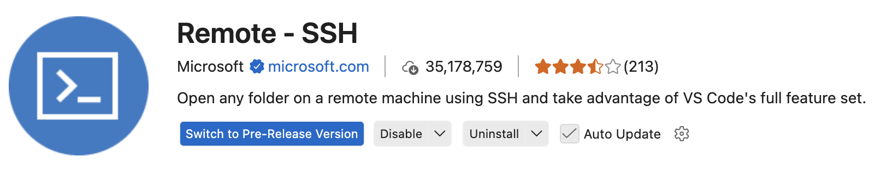
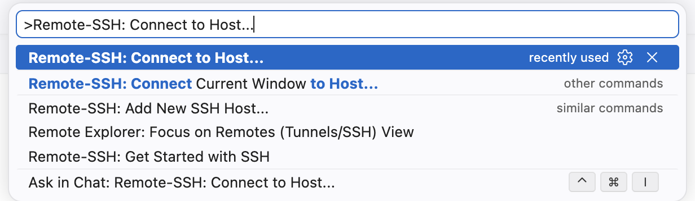
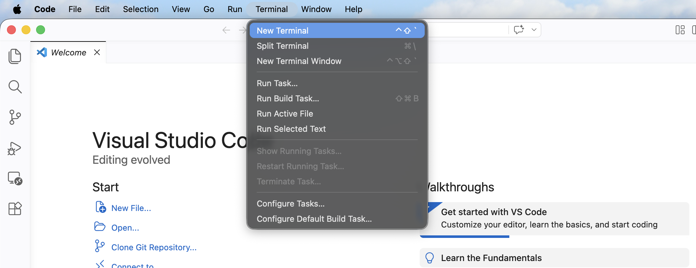
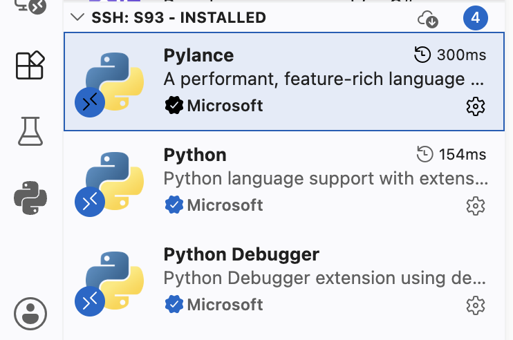

# VS Code Remote SSH

VS Code Remote SSH 可以让你在自己的电脑上打开 VS Code，但实际编辑、运行、查看的是服务器上的文件和终端。

它适合日常写代码、改配置、查看日志、管理项目文件。对于刚开始使用服务器的同学，它通常比在终端里直接使用 `vim`、`nano` 更直观。

但是需要注意：VS Code Remote SSH 不是一个“把服务器变成本地电脑”的工具。它会在远程服务器上启动 VS Code Server，并可能消耗一定的 CPU、内存和硬盘资源。因此，它适合开发和轻量交互，不适合直接承担长时间训练任务。长时间实验仍然应该配合 `tmux` 使用。

## 1. 它到底连接到了哪里

使用 Remote SSH 后，VS Code 的界面显示在你的本机电脑上，但关键操作发生在远程服务器上：

<figure markdown="span">
  { loading=lazy }
  <figcaption>VS Code Remote SSH 结构</figcaption>
</figure>

因此删除、移动、覆盖文件时要像在服务器终端里操作一样小心。

## 2. 开始前先确认普通 SSH 可以连接

Remote SSH 的底层仍然是 SSH。很多 VS Code 连接问题，其实都是普通 SSH 还没有配置好。

在打开 VS Code 之前，先在本机终端中确认可以登录服务器：

```bash
ssh vis-server
```

如果你还没有配置 `vis-server` 这个别名，请先阅读上一章的 [SSH 私钥公钥](../connecting-to-servers/ssh-key-pair.md)，尤其是 `~/.ssh/config` 的部分。

如果 `ssh vis-server` 在普通终端里不能成功，VS Code Remote SSH 通常也不会成功。先解决 SSH 连接问题，再回到本章。

## 3. 推荐使用 SSH config

虽然 VS Code 可以直接输入 `用户名@服务器地址`，但更推荐先在本机配置 SSH config。这样终端、VS Code、`scp`、`rsync` 等工具都可以使用同一套连接信息。

本机 SSH config 文件位置通常是：

=== "macOS / Linux"

    ```bash
    nano ~/.ssh/config
    ```

=== "Windows PowerShell"

    ```powershell
    notepad $env:USERPROFILE\.ssh\config
    ```

示例配置如下：

```sshconfig
Host vis-server
    HostName 10.30.XXX.XXX
    User jie-zhang
    IdentityFile ~/.ssh/id_ed25519_vis
    ServerAliveInterval 60
    ServerAliveCountMax 3
```

其中：

| 配置项 | 含义 |
| --- | --- |
| `Host vis-server` | 给服务器起一个本机别名。之后可以直接 `ssh vis-server`。 |
| `HostName 10.30.XXX.XXX` | 服务器真实 IP 地址或主机名。 |
| `User jie-zhang` | 服务器账号名。 |
| `IdentityFile ~/.ssh/id_ed25519_vis` | 本机私钥路径。 |
| `ServerAliveInterval 60` | 每 60 秒发送一次保活信号，减少空闲断线。 |
| `ServerAliveCountMax 3` | 连续 3 次保活失败后断开。 |

保存后，先测试：

```bash
ssh vis-server
```

能正常进入服务器后，再继续配置 VS Code。

## 4. 安装 VS Code 和 Remote SSH 扩展

你需要在本机电脑上安装：

1. [Visual Studio Code](https://code.visualstudio.com/)
2. VS Code 扩展：[Remote - SSH](https://marketplace.visualstudio.com/items?itemName=ms-vscode-remote.remote-ssh)，发布者是 Microsoft

安装扩展的方法：

1. 打开 VS Code；
2. 点击左侧 Extensions 图标；
3. 搜索 `Remote - SSH`；
4. 安装 Microsoft 发布的扩展。

{ loading=lazy }

也可以安装 Microsoft 的 **Remote Development** 扩展包。它包含 Remote SSH、WSL、Dev Containers 等扩展。对于本章来说，只安装 Remote SSH 就够了。

!!! note "Windows 用户"

    Windows 上建议使用系统自带的 OpenSSH Client，并在 PowerShell 中先确认 `ssh vis-server` 可以工作。这样 VS Code 读取 SSH config 时更稳定。

## 5. 第一次用 VS Code 连接服务器

打开 VS Code 后：

1. 按 `Ctrl + Shift + P`。macOS 也可以按 `Command + Shift + P`；
2. 输入并选择 `Remote-SSH: Connect to Host...`；
{ loading=lazy }
3. 选择 `vis-server`；
4. VS Code 会打开一个新的窗口；
5. 如果询问服务器类型，选择 `Linux`；
6. 第一次连接时，VS Code 会在服务器的 home 目录下安装 VS Code Server；
7. 连接成功后，左下角通常会显示 `SSH: vis-server`。


连接完成后，打开 VS Code 内置终端：

```text
Terminal -> New Terminal
```
{ loading=lazy }

在终端中执行：

```bash
whoami
hostname
pwd
```

如果输出的是你的服务器用户名、服务器主机名和服务器目录，说明你已经在远程环境中工作。

## 6. 打开正确的项目文件夹

Remote SSH 连接成功后，下一步是打开服务器上的项目文件夹。

推荐先在服务器 home 目录下整理一个项目目录，例如：

```bash
mkdir -p ~/projects
```

然后在 VS Code 中选择：

```text
File -> Open Folder...
```

常见路径可能是：

```text
/home/jie-zhang/projects
/home/jie-zhang/projects/my-experiment
```

!!! warning "不要随便打开太大的目录"

    不建议直接打开 `/`、`/home`、大型数据集目录或包含大量实验输出的目录。

    VS Code 和一些扩展可能会扫描项目文件。如果目录里有大量图片、日志、模型权重、缓存文件，可能导致 VS Code 变慢，也可能给服务器增加不必要的负载。

比较推荐的习惯是：一个项目打开一个项目文件夹，数据集、模型权重、大型结果目录放在项目外，或通过配置排除。

## 7. 在 VS Code 里使用远程终端

VS Code 的内置终端在 Remote SSH 模式下就是服务器终端。你可以像普通 SSH 一样执行命令：

```bash
pwd
ls
nvidia-smi
python --version
```

如果你使用 conda 或 venv，也需要在这个终端中激活环境：

```bash
conda activate your-env-name
```

短时间测试可以直接在 VS Code 终端中运行，例如：

```bash
python test.py
```

但长时间训练、下载、压缩、批处理任务不要只依赖 VS Code 终端。VS Code 窗口关闭、网络断开或远程连接中断时，普通终端里的任务可能会被影响。

长时间实验建议使用 `tmux`：

```bash
tmux new -s exp1
python train.py
```

暂时离开 tmux：

```text
Ctrl + B，然后按 D
```

重新进入：

```bash
tmux attach -t exp1
```

后续会在 [tmux 和运行实验](../running-experiments/tmux-and-experiments.md) 中详细介绍。

## 8. VS Code 扩展也分本机和远程

连接远程服务器后，有些扩展会提示安装到远程环境，例如 Python、Jupyter、C/C++、GitLens 等。但是本机安装的扩展在服务器端不一定可用。

安装到远程端的扩展会在服务器上运行，可能消耗服务器资源。

建议只在远程端安装必要扩展。比如写 Python 项目时，通常安装 Python 和 Jupyter 就够了。

如果某个扩展导致远程 VS Code 很卡，可以在扩展（Extensions）页面里 禁用远端的 SSH 扩展。

{ loading=lazy }

## 9. 文件传输

Vscode Remote SSH 可以很方便地编辑服务器文件，也可以拖拽少量小文件，比如代码、配置文件、图片或文档。但它不是大规模文件传输工具。

数据集、模型权重或大型压缩包等大型文件则不建议用 VS Code 传输。大文件传输建议使用 `scp`、`rsync`、SFTP 或专门的文件同步工具。后续会在 [文件传输](./file-transfer.md) 中介绍。

## 参考

* [Visual Studio Code: Remote Development using SSH](https://code.visualstudio.com/docs/remote/ssh)
* [Santa Clara University: HPC Access via VSCode](https://www.scu.edu/wave/wave-hpc/getting-started/hpc-access-via-vscode/)
* [Caltech HPC Center: VSCode](https://www.hpc.caltech.edu/documentation/software-and-modules/vscode)
* [Princeton Research Computing: Visual Studio Code](https://researchcomputing.princeton.edu/support/knowledge-base/vs-code)
* [NYU Abu Dhabi CRC: Connecting VS Code to HPC using SSH](https://crc-docs.abudhabi.nyu.edu/hpc/system/vscode.html)
